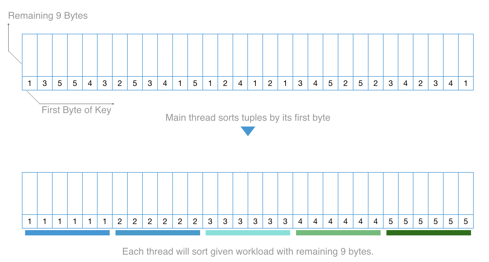
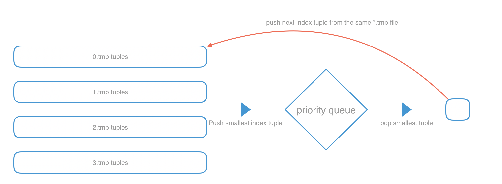
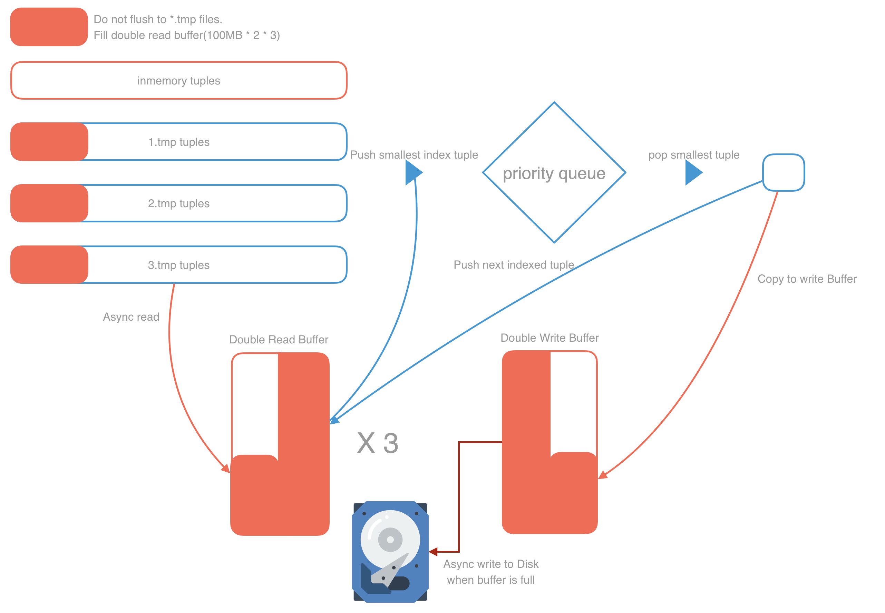

# Parallel External Sort

## Table of Contents

* [How To Run](#how-to-run)
* [Testing](#testing)
* [Design](#design)
* [Performance](#performance)

## How To Run

You must run either `make` or `make CFLAGS+=-DVERBOSE` once before executing `run` file.

**NOTE** that infile must holds tuple of {key_size 10 bytes + payload 90 bytes}.

Size of infile does not matter, but memory limitation(2GiB) will not be guaranteed if *file size* exceeds 4GB.

|         Command          | Description                                                  |
| :----------------------: | ------------------------------------------------------------ |
|          `make`          | Create excutable file named 'run' on root folder             |
| `make CFLAGS+=-DVERBOSE` | Program will tell more about execution time of read / sort / write. |
|       `make clean`       | Remove all executable & *.test & *.tmp files from the folder. |
|  `./run infile outfile`  | Program will read tuples from infile and write sorted tuples to outfile. |

## Testing

[gensort](http://www.ordinal.com/gensort.html) can help to create input file & test output file's correctness check.

Download gensort from the link, move `gensort` & `valsort` executable files to root folder of project.

|         Command          | Description                                                  |
| :----------------------: | ------------------------------------------------------------ |
| `./gensort SIZE OUTFILE` | create file named *OUTFILE* with size of *SIZE*. Below is the commands used to test `gensort 10000000 input_1GB.data` `gensort 20000000 input_2GB.data` `gensort 40000000 input_4GB.data -s` (skewed keys) |
|   `./valsort OUTFILE`    | Check if keys are well sorted in *OUTFILE*. Assume you ran command `./run input_1GB.data output_1GB.test` Use `./valsort output_1GB.test` for check correctness. |

## 

## Design

Program runs in different way based on the input file size. If *file_size* <= 2GB, it means program can hold all tuples inmemory without exceeding memory limitation(2GiB). So it does not have to perform external sort with extra *.tmp files.

### Read

Program will perform parallel read with *NUM_THREAD*(set to 16 by default. You may change it from [external_sort.h](./include/external_sort.h)) threads. Each thread will read same portion from input file.

If *infile* cannot be held inmemory, program will read 1GB per each iteration, sort them, saves as *.tmp file and repeat the process until reach end of file.

### Sort

#### Radix Sort

With the help of [radix sort](https://github.com/voutcn/kxsort), program starts to sort the datas based on their key. To increase speed, program's main thread will sort tuples only by first byte. And spread workload of sorting rest 9 bytes of key to other threads with openmp.

#### External Merge Sort

For *file_size* > 2GB, all tuples in input file cannot be sorted at once. Thus, program will sort chunks(1GB) and save it to *.tmp files. 

In order to concat all *.tmp files, program uses priority_queue to decide smallest tuple to write in *outfile*.

##### Double Buffer

To increase performance, best way to do so in reduce I/O operation & reduce waiting time for the I/O operation. In order to achieve this, program is implementing the concept of double buffer.

main thread will execute push & pop from the one side of *double read buffer*(that exists for each *.tmp files), while doing so, other side of double read buffer will be used to **asynchronously** read *.tmp file. By doing so, main thread almost never waits to read new tuples from the disk.

*Double Write Buffer* works in the same way. poped tuple(smallest) will be copied to the one side of the tuple. If current side of the buffer is full, main thread will **asynchronously** write current buffer. And while doing so, use the other side of the buffer to fill in. This again, makes main thread to hold as minimum as possible to write.

##### Reduce I/O Operation

Disk is always the slowest part of the program. Therefore, I/O operation works as bottleneck for the program execution. It is always a good idea to minimize I/O operation to achieve better performace. So the program holds as most tuples as possible in memory. 

That is, instead of writing 4 chunk tuples(1GB each) into the disk, it holds... 

1. 1 chunk (1GB) inmemory
2. 200MB (100MB * 2) for rest of the chunk(3) to fill initial *Double Read Buffer*. (100MB * 2 * 3 = 600MB)

So instead of read&writing 4GB of tmp files, it only have to read&write 2400MB.

### Performance

As my code implements new technique, the performance of the program got better. Here is some changes I've made and history of the results.

##### Radix Sort

##### Parallel Radix Sort

Main thread sorts first byte of the key, and distribute workload of sorting rest of 9 bytes to other threads.

##### Last Tmp File Stays Inmemory

##### Minimize memcpy

Reduce operation of copying memory (which occured very frequently, and each operation copied 100 Bytes) by using pointers & classes.

##### Final

Saves I/O operation by not flushing 200MB for each tmp files & remove unnecessary codes.

