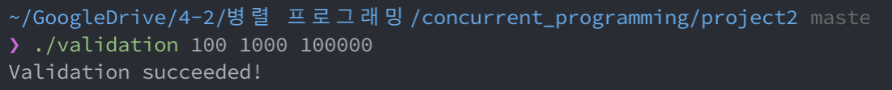

# Parallel External Sort

[](https://github.com/LazyRen)

## Table of Contents

* [How To Run](#how-to-run)
* [Implementation](#implementation)
  * [Tasks](#tasks)
  * [Classes](#classes)
  * [Read/Write Lock](#read/write-lock)
* [Validation](#validation)


## How To Run

You must run either `make` or `make CFLAGS+=-DVERBOSE` once before executing `run` file.

|         Command          | Description                                                  |
| :----------------------: | ------------------------------------------------------------ |
|          `make`          | Create excutable file named 'run' on root folder             |
| `make CFLAGS+=-DVERBOSE` | Program will tell more about transactions.                   |
|       `make clean`       | Remove all executable & thread*.txt files from the folder.   |
|      `./run N R E`       | Program will execute `E` transactions on `R` records with `N` threads. |
|   `./validation N R E`   | Check validation of created thread*.txt files by running single thread execution. You must run `.run N R E` before running this command. |

**NOTE** *N*, *R*, *E* will be considered as a positive  `int`. Program does not guarantee execution of overflowed *N*, *R*, *E*.

## Implementation

### Tasks

1. Randomly pick up three different records *i*, *j*, *k* respectively.

2. Acquire a global mutex that protects a lock table.

3. Acquire a reader lock for reading a value of the record *i*, *R<sub>i</sub>*.

   • If it need to wait for acquiring the lock, do *deadlock checking*.

4. Release the global mutex.

5. Read *R<sub>i</sub>*.

6. Acquire the global mutex again.

7. Acquire a writer lock for writing a value of the record *j*, *R<sub>j</sub>*.

   • If it need to wait for acquiring the lock, do *deadlock checking*.

8. Release the global mutex.

9. Increase the value of *R<sub>j</sub>* by *R<sub>i</sub> + 1. i.e., *R<sub>j</sub>* = *R<sub>j</sub>* + *R<sub>i</sub>* + 1. (*R<sub>i</sub>* is the value you have read at step 5)

10. Acquire the global mutex again.

11. Acquire a writer lock for writing a value of the record *k*, *R<sub>k</sub>*.

    • If it need to wait for acquiring the lock, do *deadlock checking*.

12. Release the global mutex.

13. Decrease *R<sub>k</sub>* by *R<sub>i</sub>*. i.e., *R<sub>k</sub>* = *R<sub>k</sub>* - *R<sub>i</sub>*.
    (*R<sub>i</sub>* is the value you have read at step 5)

    —————— committing phase ——————

14. Acquire the global mutex.

15. Release all reader/writer locks acquired by this transaction.

16. Increase the global execution order by 1,and then fetch it as *commit_id*. Initialvalue of the global execution order is 0 so that the first *commit_id* need to be 1.

    • If *commit_id* is bigger than *E*, rollback all changes made by this transaction (Undo), and then release the global mutex, and terminate the thread.

    Append a **commit log** into the thread#.txt with the below format:

    ​	[*commit_id*] [*i*] [*j*] [*k*] [*R<sub>i</sub>* ] [*R<sub>j</sub>* ] [*R<sub>k</sub>* ]

17. Release the global mutex.

    —————— committed ——————

**CHANGE** has been made to perform **undo transaction** before **step *15***. <br>Since the transaction holds global lock, it can undo transaction after releasing the lock without any issues. But it seemed a bit odd to modify value of records after releasing the record lock.


### Classes

##### ThreadInfo

```c++
class ThreadInfo {
public:
  int tid;
  unordered_map<int, Lock*> locks;
  ThreadInfo(int tid) : tid(tid) {}
};
```

Each worker thread creates ThreadInfo object to indicate acquired / or trying to acquiring locks. Information about these locks will be used during the *deadlock check*.


##### Record

```c++
class Record {
public:
  int64_t data;
  condition_variable_any cv;
  int cur_readers;
  deque<Lock> lock_deque;
  Record() :
    data(100), cur_readers(0) {}
  Record(int64_t data) :
    data(data), cur_readers(0) {}
};
```

Each record holds deque of *Lock* object and condition variable.<br>Record uses these two to mimic the concept of lock. Thread that holds the front lock object from the deque will be allowed to proceed. (Or threads that hold consecutive reader lock object)<br>Deque of *Lock* will be also used for `DeadlockCheck()` & `CanWakeUp()` function which decides whether calling thread may(acquire the lock) or may not proceed(waiting for the lock).


##### Lock

```c++
class Lock {
public:
  LockType lock_type;
  int tid;
  int rid;
  bool is_acquired;

  Lock(LockType lock, int thread, int record) :
    lock_type(lock), tid(thread), rid(record), is_acquired(false) {}
};
```

This class contains all the information it needs for the deadlock check & lock related actions.


### Read/Write Lock

```c++
bool AcquireReadLock(int tid, int rid);
void ReleaseReadLock(int tid, int rid);
bool AcquireWriteLock(int tid, int rid);
void ReleaseWriteLock(int tid, int rid);
```

**Note** that any lock related operations(acquiring/releasing) requires thread to hold the global mutex before calling the function. Calling above functions without obtaining global mutex lock will cause undefined behavior and most likely pause the program.

#### Acquiring the lock

It first emplace new lock object to back of the specified record's deque.<br>And also updates ThreadInfo's lock information for future deadlock check.<br>**Note** that if deadlock has been found during the execution, function will remove created lock object from record's deque & ThreadInfo and return false.

* read lock<br>
  * Acquire without wait
    If there is no write lock in current record's deque, lock is obtained, and can be proceed.
* write lock<br>
  * Acquire without wait
    If newly created lock object is the only object witin the deque, write lock is obtained, and can be proceed.

If above is not the case, thread must wait before obtaining the lock. It performs `DeadlockCheck()` before calling wait on `condition variable`.<br>All threads will be wake up when record's read/write lock is released. Those threads will run `CanWakeUp()`  to check who owns the lock. Only threads that owns the lock will proceed, and rests falls into sleep by calling wait on `condition variable` again.


#### Releasing the lock

Function removes lock object from Record's deque & ThreadInfo.<br>If current thread was the last read lock holder or write lock holder, thread is responsible to notify the lock has been released for the future use. So it calls `records[rid].cv.notify_all();` to wake up all threads waiting for the lock. Lock's ownership will be decided by  `CanWakeUp()` function later.


#### CanWakeUp()

```c++
bool CanWakeUp(int tid, int rid, LockType lock_type);
```

This function will return true if and only if current thread(*tid*) can hold lock on record(*rid*).<br>That is, if thread is waiting for the read lock, there must be no write lock in front of current lock object in deque.<br>If thread is waiting for the write lock, it's lock object must be positioned in front of the deque.<br>Any other cases will return false.


#### DeadlockCheck()

```c++
bool DeadlockCheck(int tid);
```

Function uses *ThreadInfo* & *Record's deque<Lock>* to see if waiting threads are forming the cycle.<br>Function uses **BFS**(queue) to see if there is a cycle.<br>Function returns `true` when it founds the deadlock.


## Validation

Thanks to 정채홍 for providing source code of [validation.cpp](./validation.cpp).<br>Running `./validation N R E` will read all thread*.txt files and perform single-thread transaction to validate the logs.

