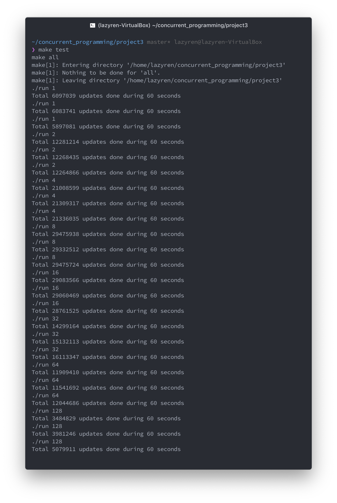

# Multi-thread Database

[](https://github.com/LazyRen)

## Table of Contents

* [How To Run](#how-to-run)
* [Implementation](#implementation)
  * [Tasks](#tasks)
  * [Classes](#classes)
    * [Wait Free Snapshot](#wait-free-snapshot)
    * [Epoch Based Garbage Collection](#-epoch-based-garbage-collection)
  * [Preventing Memory Leak](#preventing-memory-leak)
* [Test Results](#test-results)


## How To Run

You must run either `make` or `make CFLAGS+=-DVERBOSE` once before executing `run` file.

|         Command          | Description                                                |
| :----------------------: | ---------------------------------------------------------- |
|          `make`          | Create excutable file named 'run' on root folder           |
| `make CFLAGS+=-DVERBOSE` | Program will tell more about transactions.                 |
|       `make clean`       | Remove all executable & thread*.txt files from the folder. |
|        `./run N`         | Program will spin update with `N`  threads for 60 seconds  |

**NOTE** *N* will be considered as a positive  `int`. Program does not guarantee execution of overflowed *N*.<br>If you wish to run program with diffrent duration(default: 60 seconds), change `TaskRunner`'s second argument.

## Implementation

### Tasks

1. When program is executed, it first creates TaskRunner object with defined `number of threads` & `execution time`.
2. Each thread keeps *update* its own variable in WFSnapshot for a given duration(1 min.) and total updates done by all threads will be returned after all jobs are finished
3. While doing so,GC thread will be in charge of garbage collection of snapshot by using **Epoch Based Garbage Collection**. GC prevents any possible memory leak that can be caused within *update*. Detail of implementation will be explained [later](#epoch-based-garbage-collection).


### Classes

#### Wait Free Snapshot

The implementation of **Wait-free Snapshot** structure is based on the text book `The Art of Multiprocessor Programming` ch.4-3.<br>There has been a slight modification to it in order to port skeleton code into **C++**. Such modification includes way to deal with possible memory leak / order of update within `StampedData` structure (concurrency).


##### StampedData

```c++
template <typename T>
class StampedData {
private:
  T value;
  T *snapshot;
  ll stamp;

public:
  StampedData(T _value = 0, ll _stamp = 0, T* _snap = nullptr)
    : value(_value), snapshot(_snap), stamp(_stamp) {}

  StampedData(const StampedData& other)
    : value(other.value), snapshot(other.snapshot), stamp(other.stamp) {}

  T Read() const
  {
    return value;
  }

  void update(T _value, T* _snap, ll _stamp)
  {
    snapshot = _snap;
    stamp    = _stamp;
    value    = _value;
  }

  T* GetSnapshot() const
  {
    return snapshot;
  }

  ll GetStamp() const
  {
    return stamp;
  }
};
```

Also known as `StampedSnapshot`, it holds snapshot of all threads value & timestamp.<br>**Note** that actual `value` is updated at last within `update()` function. So any `read` instruction performed while updating will read previous value. Which is still okay because `update` has not been finished yet.


##### WFSnapshot

```c++
template <typename T>
class WFSnapshot {
private:
  vector<StampedData<T>> registers;

  void collect(vector<StampedData<T>> &snapshot)
  {
    for (int i = 0; i < registers.size(); i++)
      snapshot[i] = registers[i];
  }

public:
  GarbageCollector<T> garbage_collector;

  WFSnapshot(int size)
    : registers(size), garbage_collector(size) {}

  void update(T value, int tid)
  {
    bool stolen_snapshot = false;// set to true iff taken snapshot from scan() is from other thread's update.
    T *taken_snapshot = scan(stolen_snapshot);
    if (stolen_snapshot)
      taken_snapshot[registers.size()] = -1;
    else
      taken_snapshot[registers.size()] = tid;

    StampedData<T> old_reg = registers[tid];

    garbage_collector.thread_epoch[tid] = g_epoch_counter;

    if (old_reg.GetSnapshot() && old_reg.GetSnapshot()[registers.size()] == tid)
      garbage_collector.AddGarbage(garbage_collector.thread_epoch[tid], old_reg.GetSnapshot());

    registers[tid].update(value, taken_snapshot, old_reg.GetStamp() + 1);
  }

  T* scan(bool &stolen_snapshot)
  {
    vector<StampedData<T>> old_snapshot (registers.size());
    vector<StampedData<T>> new_snapshot (registers.size());
    vector<bool> is_modified(registers.size(), false);

    collect(old_snapshot);

    while (true) {
      bool is_equal = true;
      collect(new_snapshot);

      for (int i = 0; i < registers.size(); i++) {
        if (old_snapshot[i].GetStamp() != new_snapshot[i].GetStamp()) {
          if (is_modified[i]) {
            stolen_snapshot = true;
            return old_snapshot[i].GetSnapshot();
          } else {
            is_equal = false;
            is_modified[i] = true;
            old_snapshot = new_snapshot;
            break;
          }
        }
      }

      if (is_equal)
        break;
    }

    T *result = new T[registers.size() + 1];
    for (int i = 0; i < registers.size(); i++)
      result[i] = new_snapshot[i].Read();

    return result;
  }
};
```

The detail of concurrency validation is posted on textbook, so I will only cover what has been added.<br>Dynamic memory allocation is minimized as much as possible. Only memory allocation happens within `scan()` when it succeeded capturing safe snapshot. It may *borrow* the snapshot from other thread's `update()` wich makes this structure *wait-free*.<br>

###### Adding Garbage Object

During the `update()`, thread must change snapshot within `StampedData`. If no other actions are taken, the previous snapshot will never be freed, thus cause memory leak.<br>In this implementation, right before changing the snapshot of `StampedData`, thread adds previous snapshot into garbage collector's waiting list with current global epoch. (**IFF** previous snapshot was created by itself; Allocator also responsible to deallocation)<br>Those snapshots in waiting list will be freed when it is safe to do so. (no threads are using it)


#### Epoch Based Garbage Collection

##### GCObject

```c++
template <typename T>
class GCObject {
private:
  ll epoch;
  T *snapshot;

public:
  GCObject<T> *next;

  GCObject(ll _epoch = 0, T* _snapshot = nullptr)
    : epoch(_epoch), snapshot(_snapshot), next(nullptr) {}

  ~GCObject()
  {
    delete[] snapshot;
  }

  ll GetEpoch() const
  {
    return epoch;
  }
};
```

Simple container of dynamic allocated snapshot.


##### Garbage Collector

```c++
template <typename T>
class GarbageCollector {
public:
  vector<ll> thread_epoch;
  ll salvaged;
  atomic<GCObject<T>*> garbage_list;

  GarbageCollector(int thread_num)
    : thread_epoch(thread_num), salvaged(0), garbage_list(nullptr) {}

  void AddGarbage(ll epoch, T* snapshot)
  {
    GCObject<T> *garbage = new GCObject<T> (epoch, snapshot);
    garbage->next = garbage_list.load();

    while (true) {
      bool ret = garbage_list.compare_exchange_strong(garbage->next, garbage);

      if (ret)
        break;
    }
  }

  void SalvageGarbage(bool force_salvage = false)
  {
    GCObject<T> *prev = garbage_list.load(), *cur, *next;

    if (force_salvage) {
      cur = prev;
      while (cur) {
        next = cur->next;
        delete cur;
        cur = next;
        salvaged++;
      }
      return;
    }

    if(prev)
      cur = prev->next;
    else
      cur = nullptr;
    while (cur) {
      next = cur->next;
      if (cur->GetEpoch() < *min_element(thread_epoch.begin(), thread_epoch.end())) {
        prev->next = next;
        delete cur;
        salvaged++;
      } else {
        prev = cur;
      }
      cur = next;
    }
  }
};
```

Since all worker thread can add to the waiting list, it uses *CAS* operation to make it *concurrent linked list*.<br>Only one GC thread will do checking & deallocating the GCObject.<br>Main thread will keep increament global variable `g_epoch_counter`, and for every 100000 ticks, GC thread will run `SalvageGarbage()`. If object within the list has the epoch # that is lower than any of thread's epoch #, it means no threads are using that object(snapshot). Meaning the object is safe to deallocate.


### Preventing Memory Leak

As I've mentioned earlier, simply swaping snapshot within `StampedData` while updating will cause memory leak. Because no one can safely deallocate previously stored snapshot. It cannot be deallocated while updating, because there is a change of other thread using that snapshot due to *borrowing mechanism* implemented in `scan()`.<br>Just like Java, (which language will handle the garbage collection by reference counting) `shared_ptr` can be used to count reference, but it is not safe to use in parallel programming.<br>So instead of using future C++20 atomic_shared_ptr, I chose to create my own **Epoch Based Garbage Collector**(Thank you Bw-Tree!). The problem is that program cannot deallocate snapshot because it may be used by others.<br>So why not delay the deallocation to wait other threads to finish using it?!<br>When snapshot is loaded to garbage list, it gets the epoch value synced to global epoch<br>Each thread will hold it's own epoch value which is synced to global epoch during the update.<br>So if all threads have higher epoch value than garbage object, all threads are using newly created snapshot. Therefore no one is using the garbaged snapshot. So GC thread will deallocate it.<br>

Garbage Collector thread will perform salvaging continuously with 0.1 sec delay.

## Test Results

###### Tested Environment

Virtual Machine<br>CPU: i7-6700 4 cores 3.40 GHz<br>RAM: 8 GB<br>OS: Linux 18.04<br>GCC: c++17



I ran tests with 1 ~ 128 worker thread. Each test result is average of 3 tests.


### Result Analyze

As expected, total upgrade count is increasing until 8, witch is max-thread number CPU can physically run simultaneously(with hyper-threading). After that, count decreases as more worker thread gets to work.<br>As the number of the worker thread grows, execution of `scan()` in `WFSnapshot` is most likely to fail getting a clean snapshot. So it will borrow snapshot from other thread's `update()` after looping for a while (until it finds same thread has updated twice).