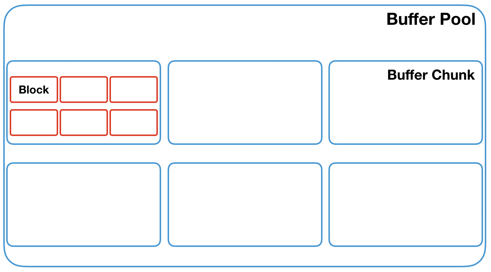
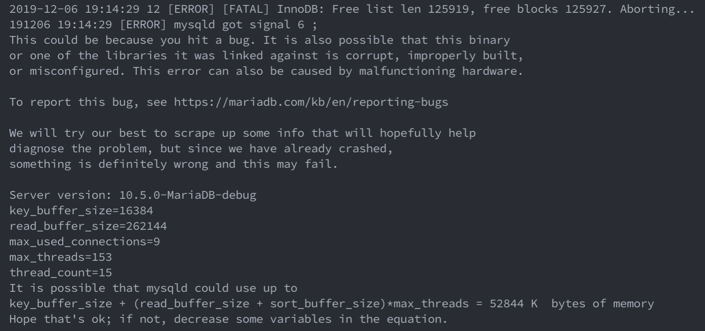
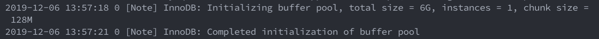
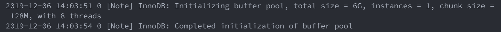
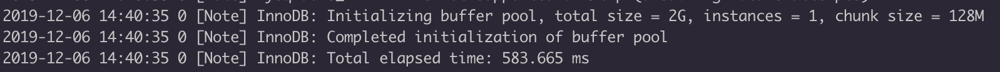
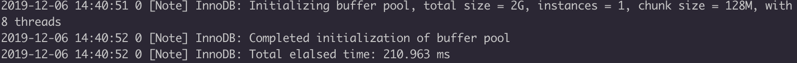
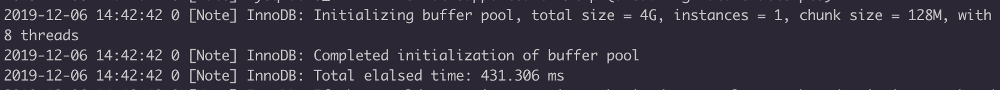
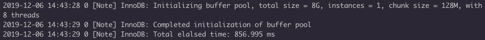
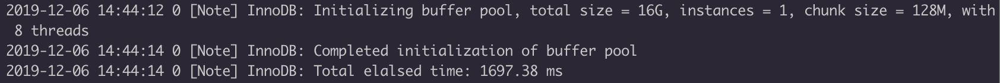
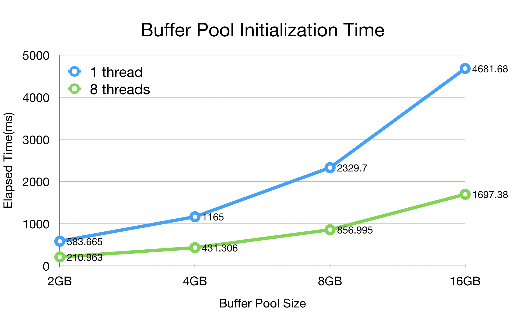

# Scalable MariaDB Buffer Pool Initialization

[](https://github.com/LazyRen)


mariaDB's last commit : `0117d0e65ac8051bc9f6d14764a2ab05e69bd895`


## Table of Contents

* [Buffer Pool Analysis](#buffer-pool-analysis)
* [Initializing Buffer Pool](#initializing-buffer-pool)
  * [Concurrent Initializing](#concurrent-initializing)
    * [Implementation Notice](#implementation-notice)
    * [Modifyied Functions](#modifyied-functions)
* [Test Results](#test-results)

## Buffer Pool Analysis

MariaDB internally holds `N` buffer pool instances. Each buffer pool instance hold's own mutex, so more than one number of instances can may enhance performance of DB.



Each buffer pool instance is allocated in buffer chunks. So the actual memory allocation is done while initializing the chunks. Initailized memory will be controled by control blocks. Colored in red in above picture. They have pointer, lock, detailed information about designated frame. Note that MariaDB uses LRU policy for the buffer pool. So each buffer pool instance maintain free / flush / LRU lists to function as a buffer pool.


## Initializing Buffer Pool

You can change buffer pool's size & number of instances by modifying `mariadb/server/inst/my.cnf` file.<br>
Recommended buffer pool size is 70-80% of the total available memory, since DB will use about 10% more than the specified size to control buffer pool. Chunk size's default value is 128MB. During the boot up of server(`srv_start()`), program calls `buf_pool_init()` to start initializing buffer pool. Within the function, it calls multiple `buf_pool_init_instance()` sequentially. Buffer pool instance has own mutex, lists to initialize. But most time consuming job is to initialize multiple buffer chunks. Original code handles this initializing sequentially like below.

```c++
do {
  if (!buf_chunk_init(buf_pool, chunk, chunk_size)) {
    while (--chunk >= buf_pool->chunks) {
      buf_block_t*	block = chunk->blocks;

      for (i = chunk->size; i--; block++) {
        buf_block_free_mutexes(block);
      }

      buf_pool->allocator.deallocate_large_dodump(
        chunk->mem, &chunk->mem_pfx, chunk->mem_size());
    }
    ut_free(buf_pool->chunks);
    buf_pool_mutex_exit(buf_pool);

    return(DB_ERROR);
  }

  buf_pool->curr_size += chunk->size;
} while (++chunk < buf_pool->chunks + buf_pool->n_chunks);
```


### Concurrent Initializing

I've changed this to use full maximum threads that machine can use to allocate multiple chunks simultaneously.

```c++
ulint cpu_cores = sysconf(_SC_NPROCESSORS_ONLN);
cpu_cores = cpu_cores <= 2 ? 1 : cpu_cores;
ulint chunks_per_thread = buf_pool->n_chunks / cpu_cores;

if (cpu_cores == 1 || chunks_per_thread == 0) {
  do {
    if (!buf_chunk_init(buf_pool, chunk, chunk_size)) {
      while (--chunk >= buf_pool->chunks) {
        buf_block_t*	block = chunk->blocks;

        for (i = chunk->size; i--; block++) {
          buf_block_free_mutexes(block);
        }

        buf_pool->allocator.deallocate_large_dodump(
          chunk->mem, &chunk->mem_pfx, chunk->mem_size());
      }
      ut_free(buf_pool->chunks);
      buf_pool_mutex_exit(buf_pool);

      return(DB_ERROR);
    }

    buf_pool->curr_size += chunk->size;
  } while (++chunk < buf_pool->chunks + buf_pool->n_chunks);
} else {
  ulint *mem_allocated = UT_NEW_ARRAY_NOKEY(ulint, cpu_cores);
  std::thread *threads = UT_NEW_ARRAY_NOKEY(std::thread, cpu_cores);

  // exit mutex for parallel free list appending
  buf_pool_mutex_exit(buf_pool);

  for (i = 0; i < cpu_cores; i++) {
    buf_chunk_t *last_chunk = (i == cpu_cores - 1) ? buf_pool->chunks + buf_pool->n_chunks : buf_pool->chunks + (i+1) * chunks_per_thread;
    threads[i] = std::thread(parallel_buf_chunk_init,
                              buf_pool,
                              buf_pool->chunks + i * chunks_per_thread,
                              last_chunk,
                              chunk_size,
                              &mem_allocated[i]);
  }

  bool allocation_succeed = true;
  for (i = 0; i < cpu_cores; i++) {
    threads[i].join();
    if (mem_allocated[i] == 0)
      allocation_succeed = false;
  }

  // re-enter mutex
  buf_pool_mutex_enter(buf_pool);

  if (allocation_succeed) {
    for (i = 0; i < cpu_cores; i++)
      buf_pool->curr_size += mem_allocated[i];
    UT_DELETE_ARRAY(mem_allocated);
    UT_DELETE_ARRAY(threads);
  } else {
    for (i = 0; i < cpu_cores; i++) {
      if (mem_allocated[i] != 0) {
        buf_chunk_t* start_chunk = buf_pool->chunks + i * chunks_per_thread;
        buf_chunk_t* last_chunk = (i == cpu_cores - 1) ? buf_pool->chunks + buf_pool->n_chunks : buf_pool->chunks + (i+1) * chunks_per_thread;
        chunk = last_chunk;
        while (--chunk >= start_chunk) {
          buf_block_t*	block = chunk->blocks;

          for (ulint j = chunk->size; j--; block++) {
            buf_block_free_mutexes(block);
          }

          buf_pool->allocator.deallocate_large_dodump(
            chunk->mem, &chunk->mem_pfx, chunk->mem_size());
        }
      }
    }
    UT_DELETE_ARRAY(mem_allocated);
    UT_DELETE_ARRAY(threads);
    ut_free(buf_pool->chunks);
    buf_pool_mutex_exit(buf_pool);

    return(DB_ERROR);
  }
}
```

#### Implementation Notice

* If there is too few running cores, it will run original code instead of creating threads.

* Any failure on allocating chunks must be handled carefully. Program must deallocate all chunks before return wil `DB_ERROR`. It is bit more tricky since chunks are allocated simultaneously, but is well handled.

* Concurrent Initialization may cause MariaDB to unexpectedly shutdown due to malfunction in buffer pool's free list.

`buf_chunk_init()` calls `buf_block_init()` to initialize control block. After that, each page needs to be appended to buffer pool's free list. Problem may occurs since free list is not concurrent list, and many pages simultaneously appending to free list. I've used buffer pool's mutex to handle this issue.

```c++
if (is_parallel)
  buf_pool_mutex_enter(buf_pool);
/* Add the block to the free list */
UT_LIST_ADD_LAST(buf_pool->free, &block->page);
if (is_parallel)
  buf_pool_mutex_exit(buf_pool);
```

Critical section is covered by buf_pool mutex so only one thread may append to free list at the time. Without protecting critical section, using buffer pool such as running sysbench will cause error which ends up in shutdown.

#### Modifyied Functions

##### parallel_buf_chunk_init()

```c++
static
void
parallel_buf_chunk_init(
  buf_pool_t*  buf_pool,      /*!< in: buffer pool instance */
  buf_chunk_t* start_chunk,   /*!< out: start chunk of buffers */
  buf_chunk_t* end_chunk,     /*!< out: end chunk of buffers */
  ulint        chunk_size,    /*!< in: requested size in bytes */
  ulint*       mem_allocated) /*!< out: result of chunk allocation */
{
  buf_chunk_t *chunk = start_chunk;
  ulint i;
  ulint total_allocated = 0;

  do {
    if (!buf_chunk_init(buf_pool, chunk, chunk_size, true)) {
      while (--chunk >= start_chunk) {
        buf_block_t*	block = chunk->blocks;

        for (i = chunk->size; i--; block++) {
          buf_block_free_mutexes(block);
        }

        buf_pool->allocator.deallocate_large_dodump(
          chunk->mem, &chunk->mem_pfx, chunk->mem_size());
      }
      *mem_allocated = 0;
      return;
    }

    total_allocated += chunk->size;
  } while (++chunk < end_chunk);

  *mem_allocated = total_allocated;
}
```


##### buf_chunk_init()

```c++
static
buf_chunk_t*
buf_chunk_init(
/*===========*/
  buf_pool_t*  buf_pool,            /*!< in: buffer pool instance */
  buf_chunk_t* chunk,               /*!< out: chunk of buffers */
  ulint	       mem_size,            /*!< in: requested size in bytes */
  bool         is_parallel = false) /*!< in: if true, get mutex to append free list */
{
  buf_block_t*	block;
  byte*		frame;
  ulint		i;

  /* Round down to a multiple of page size,
  although it already should be. */
  mem_size = ut_2pow_round<ulint>(mem_size, srv_page_size);

  DBUG_EXECUTE_IF("ib_buf_chunk_init_fails", return(NULL););

  chunk->mem = buf_pool->allocator.allocate_large_dontdump(mem_size, &chunk->mem_pfx);

  if (UNIV_UNLIKELY(chunk->mem == NULL)) {

    return(NULL);
  }

#ifdef HAVE_LIBNUMA
  if (srv_numa_interleave) {
    struct bitmask *numa_mems_allowed = numa_get_mems_allowed();
    int	st = mbind(chunk->mem, chunk->mem_size(),
           MPOL_INTERLEAVE,
           numa_mems_allowed->maskp,
           numa_mems_allowed->size,
           MPOL_MF_MOVE);
    if (st != 0) {
      ib::warn() << "Failed to set NUMA memory policy of"
        " buffer pool page frames to MPOL_INTERLEAVE"
        " (error: " << strerror(errno) << ").";
    }
  }
#endif /* HAVE_LIBNUMA */


  /* Allocate the block descriptors from
  the start of the memory block. */
  chunk->blocks = (buf_block_t*) chunk->mem;

  /* Align a pointer to the first frame.  Note that when
  opt_large_page_size is smaller than srv_page_size,
  we may allocate one fewer block than requested.  When
  it is bigger, we may allocate more blocks than requested. */

  frame = (byte*) ut_align(chunk->mem, srv_page_size);
  chunk->size = (chunk->mem_pfx.m_size >> srv_page_size_shift)
    - (frame != chunk->mem);

  /* Subtract the space needed for block descriptors. */
  {
    ulint	size = chunk->size;

    while (frame < (byte*) (chunk->blocks + size)) {
      frame += srv_page_size;
      size--;
    }

    chunk->size = size;
  }

  /* Init block structs and assign frames for them. Then we
  assign the frames to the first blocks (we already mapped the
  memory above). */

  block = chunk->blocks;

  for (i = chunk->size; i--; ) {

    buf_block_init(buf_pool, block, frame);
    UNIV_MEM_INVALID(block->frame, srv_page_size);

    if (is_parallel)
      buf_pool_mutex_enter(buf_pool);
    /* Add the block to the free list */
    UT_LIST_ADD_LAST(buf_pool->free, &block->page);
    if (is_parallel)
      buf_pool_mutex_exit(buf_pool);

    ut_d(block->page.in_free_list = TRUE);
    ut_ad(buf_pool_from_block(block) == buf_pool);

    block++;
    frame += srv_page_size;
  }

  buf_pool_register_chunk(chunk);

#ifdef PFS_GROUP_BUFFER_SYNC
  pfs_register_buffer_block(chunk);
#endif /* PFS_GROUP_BUFFER_SYNC */
  return(chunk);
}
```


## Test Results

###### Tested Environment

Virtual Machine<br>CPU: i7-6700 4 cores 3.40 GHz<br>RAM: 8 GB<br>OS: Linux 18.04<br>





My Virtual Machine showed no difference in elapsed time. So I borrowed native linux machine for further tests.


###### Tested Environment

CPU: i7-9700K 8 cores 3.60 GHz<br>RAM: 32 GB<br>OS: Linux 18.04<br>Storage: Samsung 860 EVO 1TB

###### 2 GB





###### 4 GB




###### 8 GB




###### 16 GB




###### Chart



As you can clearly see from the chart, multi thread completes initialization much faster. And performance gap between concurrent / sequential initialization gets bigger as the buffer pool size increases. So if hardware supports multi-core & large memory, it would be better to use concurrent buffer pool initialization to save some time in a boot up scenario.
