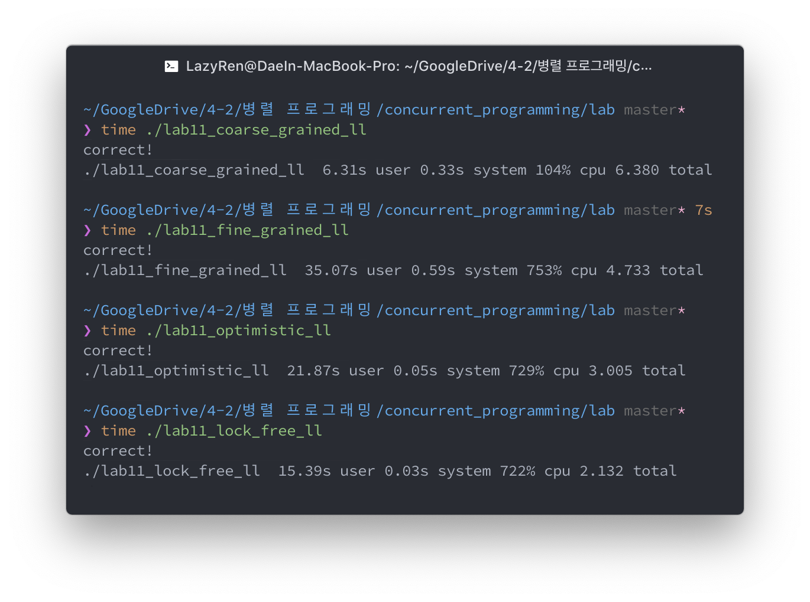

# 2019 Concurrent Programming

Projects for the 2019 Hanyang Univ. Concurrent Programming Course taught by Professor Jung, Hyung Soo.

## Table of Contents

* **[Project1 - Parallel External Sort](./project1)**
  Sorting maximum of 4GB <key, value> set with memory limitation of 2GB.

* **[Project2 - Database with Hand-made Read/Write Lock](./project2)**
  Create own read/write lock & test validation. 
  It also performs deadlock detection & resolves deadlock.

* **[Project3 - Wait-free Snapshot](./project3)**
  Capturing Wait-free Snapshot & Implementing Epoch-based Garbage Collection.

* **[Project4 - Scalable MariaDB Buffer Pool Initialization](./project4)**
  Reduce MariaDB's buffer pool initialization time by implementing parallel buffer pool initialization.

* **[Lab Works](./lab)**
    * Hand-made Locks
        * [TAS Lock](./lab/lab10_prac_tas_lock.cpp)
        * [TTAS Lock](./lab/lab10_prac_ttas_lock.cpp)
        * [CLH Lock](./lab/lab10_prac_clh_lock.cpp)
    * Concurrent Linked List
    
        * [Coarse Grained LL](./lab/lab11_coarse_grained_ll.cpp)
        * [Fine Grained LL](./lab/lab11_fine_grained_ll.cpp)
        * [Optimistic LL](./lab/lab11_optimistic_ll.cpp)
        * [Lock Free LL](./lab/lab11_lock_free_ll.cpp)
    * Concurrent Queue
        * [Coarse Grained Queue](./lab/lab12_coarse_grained_queue.cpp)
        * [Lock Free Queue](./lab/lab12_lock_free_queue.cpp)
